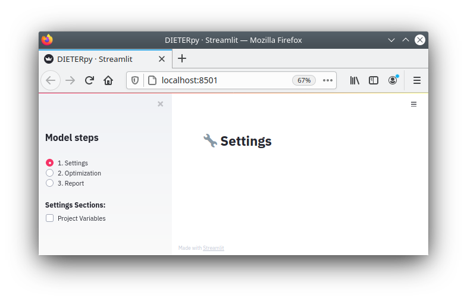
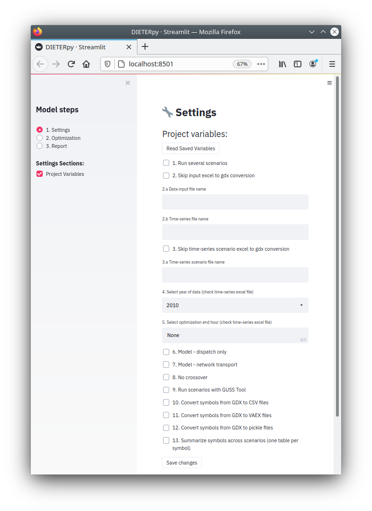
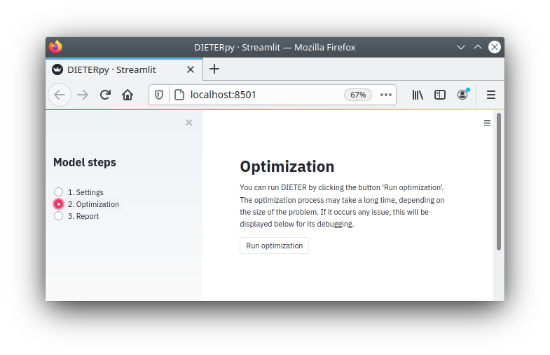
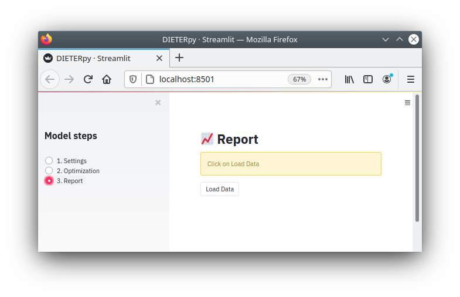
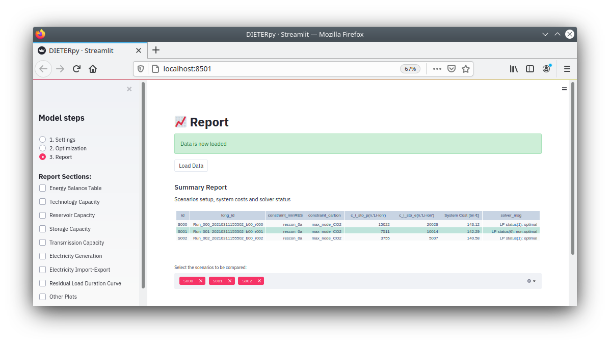

*****************************
Graphical user interface
*****************************

The graphical user interface (GUI) contains three sections: settings, optimization, report. To run the GUI you can type:

.. code-block:: bash

    $ dieterpy web

Streamlit is the Python library used to run a local server that opens a web browser. As indicated in the :ref:`CLI <prog_options>`, to run the GUI, the command line instruction has to be located in the main project folder where the file manage.py is hosted.

We can use the GUI to configure our project, run optimization and visulaize the results. Other option is executing the optimization by using the command line function :ref:`here <prog_options>` and the result can be seen using the GUI.

Settings
---------

This is how it looks like when we open the GUI, Settings pages is displayed by default. We can navegate to the other section by selecting them in the left hand-side panel.

In this section we can click in the subsection `Project variables` as shown in the image below. The `Project variables` contains the same variables that are in the project_variables.csv file. If we click on ``Read saving variables`` the tool will load data included in the mentioned file. Then we can modify the options by selecting our own configuration. Finally we click on ``Save changes`` to update the project_variables.csv with the new configuration.

.. hint:: As a feature of `streamlit` framework. You will see in the top right corner a message `running` while the server is processing the new instructions. Be patient some functions take some time. As soon the message disappears you can continue with new instructions.

Optimization
-------------

The GUI enable us to run the optimization by clickling on ``Run optimization`` button. This button replicate the command line instrucction ``dieterpy run``. What this function does is reading all configuration files and the data input.

.. hint:: Before running the optimization, verify configuration files and data input to ensure your scenarios are well configured.

Reports
------------

In this section you can visualize the results. First you have to load the results of you project by clicking on ``Load data``. The tool loads the pickles files containde in the `report_files` folder. So first make sure such folder contains. 

Once the data has been loaded, a summary report of the scenarios with the sceenario names `long_id` and the short name `id` which is the one used for the visualized tables and charts. Also a subsection will appear in the left-hand side panel. Yo can click on all the options wou want to activate.

.. hint:: If the `report_files` folder does not exist or is empty, you can run the create_report_ function in the command line before loading the data. See also this reporting_list_ section to ensure the symbols you want to obtain are in your `report_files` folder.

.. _create_report: ../configuration/config_prog.html#create-output-report
.. _reporting_list: ../configuration/reporting.html