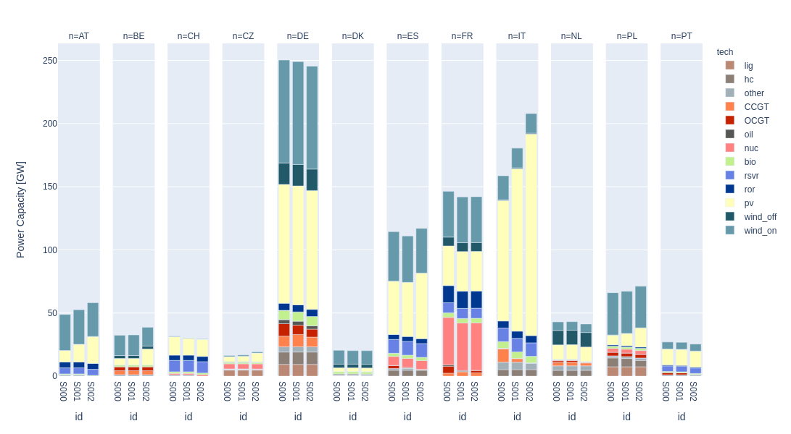
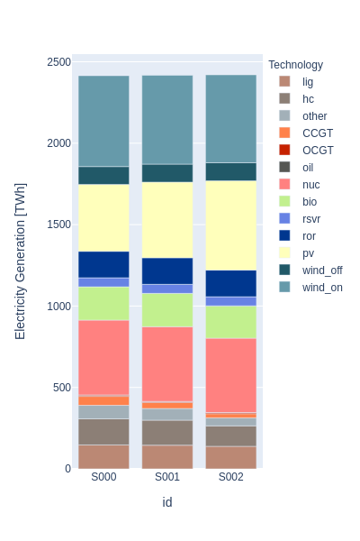

.. _example1:

Example 1
---------

**Optimal investment and dispatch of generating technologies and storage at different annualized costs for Li-Ion battery**

In this example, we would like to study the effect on the countries' optimal investments when we reduce the annualized investment costs for the two components 'energy' and 'power' of the Li-Ion battery. This example is intended to describe how to create several scenarios by modifying parameters values (annualized investment costs). Even though we do not include model features in this example, such as heating or electric vehicles, the model takes into account 12 European countries with 8760 hours; this makes the entire process to run for about 5 hours on a laptop with an AMD A12 processor, 16 GB RAM and 256 GB SSD.

To get the template folder:

.. code-block:: bash

    $ dieterpy create_project -n <give a name> -t example1

To understand the configuration of the model:

1. Scan the default data for parameters by looking at two excel files on folder `data_input`.
2. Scan the iteration_table.csv file on folder `iterationfiles`.
3. Scan the features_node_selection.csv file on folder `settings`.
4. Scan the project_variables.csv file on folder `settings`.
5. Scan the reporting_symbols.csv file on folder `settings`.

In this example the most relevant configuration is the `iteration_table.csv` as we vary two parameters ``c_i_sto_e`` and ``c_i_sto_p`` that represent the annualized costs of storage technologies for energy and power capacity. The run 0 can be considered as reference scenario. The annualized costs in run 1 represent a 50% of reference values and the run 2 a 25%.

The parameters domain can be obtained :ref:`here <symbols_list>`. For both parameters, two sets are identified ``n`` and ``sto``. The set of countries is represented by ``n`` and for storage technologies ``sto``. For parameters as well as for variables the domain can be represented by the set it self or only an element of the set. In this example, the parameters have the same value for all countries as ``n`` represents the set, while for sto only an element is assigned ``'Li-Ion'``. Elements of sets must be placed with quotation marks.

After finishing the optimization the results can be visualized by openning the browser interfce. See below some exemplary charts.

